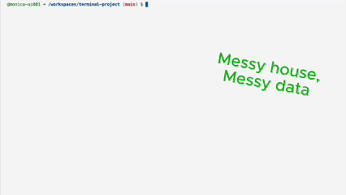

# terminal-project
Terminal Commands Project

# 🏚️ Pareto 20% of Terminal Commands — Messy House Project

This project is part of my **AI Product Systems roadmap** and demonstrates the **Pareto 20% of terminal commands** — the small set of commands that deliver 80% of the value in everyday shell work.

I, with the help of JerryGPT, built a parody dataset called the **Really Messy House** to practice.  
The files and folders include:
- `rooms.txt` → inconsistent entries for messy rooms  
- `chores.txt` → duplicated chores, weird statuses, incomplete tasks  
- `notes.txt` → chaotic free-text diary logs  
- Random junk files/folders (`giant_sauce_spill.dat`, `.sock`, `trash/`, `random_junk/`)  

This simulates what professionals call **“messy data”** — duplicates, inconsistencies, noise, and unstructured logs.

---

## 🎥 Demo

Here’s a short demo GIF recorded from my session: 

👉 [Watch the full MP4 on LinkedIn](https://www.linkedin.com/posts/m-c-a8194b37b_practicing-terminalshell-commands-https-activity-7367446470385463296-v6Gy?utm_source=share&utm_medium=member_ios&rcm=ACoAAF3vMEEBxfYm7VHUqyYluhNGNF7e4dVk2-U)

---

## ✅ Commands Covered

- **Navigation:** `pwd`, `ls -l -a -h`, `cd`, `mkdir`, `rmdir`
- **File Management:** `touch`, `cp -r`, `mv`, `rm -i`
- **Viewing & Editing:** `cat`, `head`, `tail`, `nano`
- **Text Processing:** `grep`, `cut`, `sort`, `uniq -c`, `wc`
- **Redirection & Pipes:** `>`, `>>`, `<`, `|`

---

## 🚀 Outcome

With just these commands, I was able to:

- Navigate a chaotic file system  
- Clean and reorganize “messy” text data  
- Chain commands into pipelines that summarize and simplify chaos  

This project shows how even **10% of the terminal** can deliver real-world results, and why these core commands are foundational for my future projects.

---

